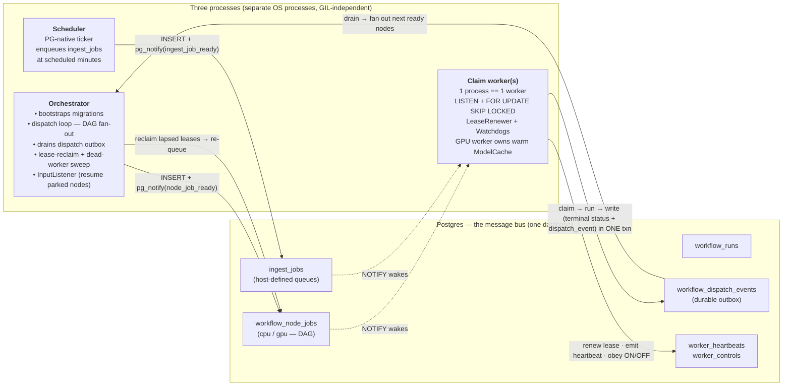

# queue_workflows

A standalone, pip-installable **Postgres-as-queue workflow engine**, extracted
from the ai_leads stack so the ~35 sibling projects can share one DRY source.

Postgres is the only hard dependency. The engine provides:

- a `SELECT … FOR UPDATE SKIP LOCKED` claim loop woken by `LISTEN node_job_ready`
  (`claim_worker`), with a `LeaseRenewer` + per-job `Watchdog`;
- lease reclaim (a dead/wedged worker's row is re-queued);
- a DAG dispatcher with a durable dispatch-event outbox (`dispatcher` + `node_pool`);
- a GPU warm-model cache that keeps one model loaded across same-model jobs
  (`model_cache` / `gpu_model_cache` / `model_registry`);
- periodic "ingest" work on a dedicated `ingest_jobs` table + a PG-native
  ticker (`scheduler` / `ingest_executor`);
- per-host CPU/GPU/RAM telemetry → `pg_notify('hw_metrics', …)` (`hw_metrics`);
- an operator worker ON/OFF control plane: a `worker_controls` table + a
  per-`(host, queue)` `WorkerControlWatcher` that hard-stops (kill in-flight +
  free RAM/VRAM) or parks a worker on command (`worker_control`; see
  `docs/worker_control.md`).

## Architecture

Three independent processes run against **one Postgres** — the database *is* the
message bus. `INSERT`ing a row is enqueuing the work; a trigger fires
`pg_notify` inside the writer's transaction, so there is no "queued but no wake"
window. A live worker renews its lease while a job runs; a dead/wedged worker's
lease lapses and the orchestrator re-queues the row.



**Two job families** share the engine: DAG **node-jobs** (`workflow_node_jobs`,
queues `cpu`/`gpu`, fanned out by the dispatcher) and standalone **ingest jobs**
(`ingest_jobs`, host-defined queues, no DAG). See `CLAUDE.md` for the full design
rationale.

## Docs

- [`docs/watchdogs.md`](docs/watchdogs.md) — the liveness model: lease renewal,
  the wall-clock + no-progress watchdogs, and the orchestrator-side dead-worker
  detector (last-resort recovery from a GPU hardware hang).
- [`docs/worker_control.md`](docs/worker_control.md) — the operator ON/OFF
  control plane (hard-stop vs park a `(host, queue)` worker).

## Quick start

```python
import queue_workflows
from queue_workflows import model_registry
from queue_workflows.model_registry import ModelSpec
from queue_workflows.scheduler import ScheduleEntry

# 1. configure (all keys optional — defaults keep ai_leads byte-compat)
queue_workflows.configure(
    db_url_env="MY_DB_URL",                 # env var holding the DSN
    video_model_ids=frozenset({"wan_i2v"}), # GPU models on the tight render budget
    node_module_package="myapp.nodes",      # node-module resolver prefix
    container_prefix="myapp-",              # cgroup attribution
)

# 2. wire the host seams
queue_workflows.set_workflow_provider(load_workflow_fn, pipeline_schema_fn)
queue_workflows.set_builtin_model_registrar(register_my_models)
queue_workflows.register_ingest_task("run_fetch_all", run_fetch_all)
queue_workflows.set_ingest_schedule([ScheduleEntry("fetch", 37, "run_fetch_all", "fetch")])

# 3. apply the engine's migration chain (idempotent), then launch
queue_workflows.db.bootstrap()             # queue tables → queue_schema_version
queue_workflows.claim_worker.main(["--queue", "gpu"])
```

Console scripts (for standalone / other-project use):

```
queue-claim-worker --queue=gpu
queue-scheduler
queue-orchestrator
```

## Migrations

The engine owns its schema as `queue_workflows/migrations/NNNN_*.sql` (shipped
as package data). `queue_workflows.migrations.dir()` returns the directory;
`queue_workflows.db.bootstrap()` applies the chain against the
`queue_schema_version` ledger. A host with its own domain tables runs a second
chain via `db.bootstrap(migrations_dir=..., version_table=...)`.

## Host-defined queues + parametrised jobs (multi-tenant)

The ingest path is not limited to ai_leads' `fetch`/`load`. A second consumer (a
non-DAG app — e.g. a forecast service) can route its **own** queue names and
carry **per-job arguments** — migration `0008` moved the queue allow-list from a
DB CHECK to host-side validation (mirroring `task_name`), added an `args` column,
and dropped the cpu/gpu-only `worker_heartbeats` CHECK.

```python
queue_workflows.configure(
    db_url_env="MY_DB_URL",
    ingest_queues=frozenset({"ingest", "hydro", "hydraulic", "corrdiff"}),  # NOT cpu/gpu (reserved for the DAG path)
    ingest_default_budget_s=3600,            # watchdog budget for these queues
)
queue_workflows.register_ingest_task("run_scenario", run_scenario)   # fn(reason) OR fn(reason, args) -> dict

# parametrised + atomic with the host's own row (NOTIFY rides the caller's txn):
with my_pool.connection() as conn:
    my_create_scenario(conn, scenario_id)
    node_queue.enqueue_ingest_job(
        task_name="run_scenario", queue="hydraulic",
        args={"scenario_id": scenario_id}, conn=conn,
    )

# hour-restricted cadence (no longer fires 24×/day):
ScheduleEntry("glofas", minute=30, task_name="run_glofas", queue="ingest", hours=frozenset({6}))

# queue-indicator data for the non-cpu/gpu queues:
node_queue.ingest_snapshot()   # {"queues": {q: {queued, running, completed, failed, workers}}}
```

A registered callable may be `fn(reason)` (args ignored, back-compat) or
`fn(reason, args)`. Ingest workers now emit `worker_heartbeats`, so
`ingest_snapshot()[...]["workers"]` reflects live workers per queue. `cpu`/`gpu`
stay reserved for the DAG node path; ingest queues require migration version 8.

## Tests

```
pip install -e '.[test]'
QUEUE_WORKFLOWS_TEST_DB_URL=postgresql://user:pw@host:port/queue_workflows_test \
  python -m pytest
```

The suite forces a `*_test` DB and applies the engine migration chain only. See
`tests/conftest.py`.
