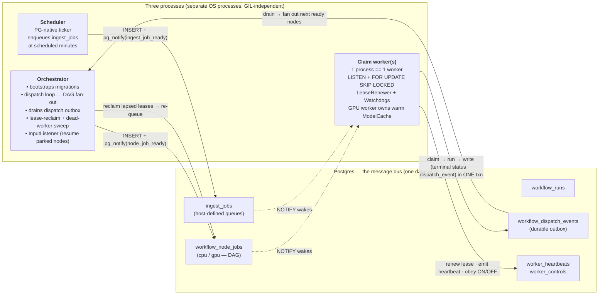

<div align="center">

# ⚙️⚡ queue_workflows

### Turn your local GPUs into one self-healing inference fleet.

Orchestrate model jobs across the machines you already own — keep each model warm, flip any box ON/OFF, auto-recover from crashes — with nothing but Postgres. No Celery, no Redis, no cluster scheduler to babysit.

⭐ **Give me a star if you find it useful :)**

[](https://github.com/robertziel/python_workflows_queue/releases)
[](LICENSE)
[](#installation)
[](#installation)
[](CHANGELOG.md)

</div>

**queue_workflows** is a small, self-hosted workflow engine where **the database _is_ the message bus**. Inserting a row enqueues work; a trigger fires `LISTEN/NOTIFY` inside the writer's transaction, so there's no "queued but never woken" gap. Workers claim jobs with `SELECT … FOR UPDATE SKIP LOCKED`, renew a lease while they run, and a dead or wedged worker's job is automatically re-queued onto a healthy peer. It runs DAG node-jobs and periodic background jobs over a handful of heterogeneous boxes, lets you flip any machine's worker **ON/OFF** on demand, and keeps a GPU model warm across same-model jobs — all on hardware you already own. _(It began as the queue core of a larger self-hosted stack, now extracted as one DRY, reusable library.)_

<p align="center">
  
</p>

> **The dashboard is _not_ part of the package — the engine just emits what one needs.** The shot above is an example UI built on `pg_notify('hw_metrics', …)`, `worker_heartbeats`, the `node_queue.*_snapshot()` snapshots, and the `worker_control` ON/OFF toggles. Bring your own front-end — it's a great task to hand a coding agent.

---

## Table of Contents

- [Why queue_workflows?](#-why-queue_workflows)
- [Highlights](#-highlights)
- [Installation](#installation)
- [Core concepts](#-core-concepts)
- [How it works (architecture)](#️-how-it-works-architecture)
- [Example implementation](#example-implementation)
- [Turning workers on/off](#️-turning-workers-onoff--the-operator-control-plane)
- [Host-defined queues + ingest jobs](#️-host-defined-queues--parametrised-ingest-jobs-multi-tenant)
- [Pluggable storage backends](#️-pluggable-storage-backends--pg--redis--mongodb)
- [LLM backends (ollama / vLLM)](#-llm-backends--per-machine-ollama--vllm-with-an-idle-supervisor)
- [Migrations](#️-migrations)
- [Tests](#-tests)
- [Docs](#-docs)
- [Background](#-background)
- [Contributing](#-contributing)
- [License & support](#️-license--support)

---

## ✨ Why queue_workflows?

The pitch in one line: **your Postgres is already the most durable thing you run — so let it _be_ the queue.** No second broker to babysit, no scheduler cluster to operate. You `INSERT` a row inside your own transaction and the work is enqueued; a dead worker's lease lapses and the row is re‑queued. Purpose‑built for a **small, self‑hosted, heterogeneous CPU/GPU fleet you already own** — not a 1,000‑node cloud.

**Reach for it when** you have a handful of self-hosted CPU/GPU boxes you already own, want GPU-aware scheduling (warm models, per-box ON/OFF) and crash-safe recovery, and would rather not stand up a broker or a workflow platform just to move jobs between machines.

**Look elsewhere when** you need a hosted UI, multi-region durability, or versioned-workflow replay at large scale — that's a different class of tool.

> ⭐ **Give me a star if you find it useful :)** — it genuinely helps other small‑fleet operators find the project.

---

## 🌟 Highlights

- 🔒 **Exactly-once claims** — `SELECT … FOR UPDATE SKIP LOCKED` over a Postgres queue, woken instantly by `LISTEN node_job_ready` so workers never poll-spin or double-run a job.
- ❤️‍🩹 **Self-healing leases** — a live worker renews its lease as it runs; a crashed or wedged worker's lease lapses and the orchestrator re-queues the row onto a healthy peer.
- 🔗 **DAG dispatch with a durable outbox** — a node's terminal status and its dispatch event are written in one transaction, then drained to fan out the next ready nodes — no lost edges, no double fan-out.
- 🔥 **GPU warm-model cache** — keeps a single model resident across consecutive same-model jobs and only drops/reloads on a real swap, so the expensive load happens once.
- 🟢 **Operator ON/OFF control** — hard-stop or park any `(host, queue)` worker on demand; a hard stop requeues the in-flight job to a free peer and frees its RAM/VRAM, with no restart.
- 📊 **Per-host telemetry** — live CPU/GPU/RAM and capacity stream over `pg_notify('hw_metrics', …)` plus `worker_heartbeats`, ready to drive a dashboard.
- ⏰ **PG-native scheduler** — a built-in ticker enqueues recurring background jobs at scheduled minutes (with optional hour windows) — no cron, no external beat process.

---

## Installation

Requires **Python 3.10+** and **Postgres 14+**. The only hard runtime dependency is `psycopg`.

Not on PyPI yet — install straight from GitHub:

```bash
pip install "queue_workflows @ git+https://github.com/robertziel/python_workflows_queue"
```

Optional extras:

```bash
# hw_metrics CPU/RAM probe (GPU probe shells out, no extra dep)
pip install "queue_workflows[metrics] @ git+https://github.com/robertziel/python_workflows_queue"

# alternative storage backends
pip install "queue_workflows[redis]   @ git+https://github.com/robertziel/python_workflows_queue"
pip install "queue_workflows[mongodb] @ git+https://github.com/robertziel/python_workflows_queue"   # needs a replica set
```

---

## 🧩 Core concepts

The mental model is small but it pays to get it exactly right, because every other feature (the dispatcher, the watchdogs, the ON/OFF control plane) is just bookkeeping around these few ideas. Read this once and the rest of the README falls into place.

At the heart of it: **the database is the message bus.** A piece of work is a *row*. Enqueuing it is an `INSERT`. Claiming it is a single `UPDATE … FOR UPDATE SKIP LOCKED`. There is no broker to run, no separate queue daemon to babysit — just Postgres and a handful of worker processes.

What flows through that bus comes in two shapes, and the first job is to tell them apart.

### The three-tier hierarchy

The richer of the two shapes is the **DAG side**: a layered recipe that the engine fans out into individual units of work. There are exactly three tiers, and the golden rule is that **each layer only ever calls the one directly below it** — a workflow never reaches past a pipeline to touch a node; a pipeline never calls another pipeline.

```
workflow   ── a pausable, multi-pipeline recipe          (defined in JSON)
   │  orchestrates ↓   (and only pipelines)
pipeline   ── a typed DAG of steps                        (a schema owning a `nodes` list)
   │  orchestrates ↓   (and only nodes)
node       ── the atomic unit of work = one run() function (a single Python module)
```

| Tier | What it is | Who runs it | Analogy |
|---|---|---|---|
| 🗺️ **Workflow** | A high-level **recipe** that strings several pipelines together and may **pause for a human** between them. Declared as data (JSON), not code. | The dispatcher reads it to know which pipelines to run, in what order. | A *playlist* |
| 🔗 **Pipeline** | A **typed DAG** — the actual graph of steps, with dependency edges. The pipeline *schema* owns the `nodes` list and the wiring between them. | The dispatcher walks this graph to decide what's ready. | A *track* with movements |
| ⚙️ **Node** | The **atomic unit**: exactly one `run(...)` function in one module. It does one thing — call a model, transform a file, hit an API — and returns a result. | A claim worker, in-process. | A single *note* |

A node is deliberately tiny. The engine introspects your `run(...)` signature and auto-wires well-known parameters (an output dir, a model handle, a `status_callback` for progress, a `cancel_event`, the resolved `inputs`), so a node author writes a plain function and the engine handles the plumbing.

> 💡 **Why three tiers and not two?** Earlier designs stopped at *pipelines orchestrate nodes*. The workflow tier was added on top so a multi-stage process could **pause mid-flight for human input** and resume later — something a single DAG run can't express cleanly. The pausing happens *between* pipeline stages, which is exactly where a person wants to inspect a result and make a choice.

### Node-jobs: how the DAG actually executes

A workflow/pipeline/node is the *definition*. A **node-job** is the *execution* — one concrete run of one node, recorded as a row in **`workflow_node_jobs`** and routed to either the **`cpu`** or the **`gpu`** queue. (Same node, run twice, two node-job rows.)

When a fresh `mode='node'` run lands in `queued`, the **orchestrator's dispatch loop** expands it: `dispatcher.start_run` reads the workflow/pipeline definition and enqueues the entry nodes as node-jobs. From there the graph drives itself:

- ✅ **A node becomes ready when all its dependencies are `completed` (or `skipped`).** The dispatcher checks this on every node's terminal event and enqueues whatever just unblocked. No central scheduler ticks through the graph — completion *events* pull the next nodes forward.
- 🔗 **One node's output feeds the next via `$from` references.** A downstream node declares an input like `{"$from": "svinfer.primary_file"}`, and at execute time the worker re-resolves that reference against the live run context — so it always reads the *actual* upstream result, never a stale enqueue-time snapshot. A tiny mini-language (`$value`, `$from`, `$filter`, `$eq`/`$ne`) covers literals, nested lookups, list filtering, and branch predicates.
- ⏸️ **A node can pause for a human.** An *input* node, when claimed, doesn't compute — it flips itself and the run to **`awaiting_input`** and emits a dispatch event describing what it needs. The run simply waits. When a value arrives (an operator submits it), the engine's `InputListener` notices, records it into the run context, and **resumes** the parked node so the DAG continues. This is the workflow tier's pause-and-resume, made concrete.

The worker → dispatcher handoff is a **durable outbox**: when a worker finishes a node it writes the terminal status **and** a `workflow_dispatch_events` row in *one transaction*. The orchestrator drains that outbox and fans out the next ready nodes. Fan-out is therefore retryable and never synchronously coupled to the worker that happened to run the node — a worker can die the instant after it commits and the graph still advances.

<details>
<summary>🌰 <b>A concrete mental model</b> — a two-stage "inspect a street-view image" workflow</summary>

Picture a workflow with two pipelines and a human checkpoint between them:

```
workflow: "streetview_inspect"
│
├─ pipeline A: detect            (GPU)
│     node  sv_fetch    →  sv_detect    →  sv_annotate
│     (CPU)              (GPU)           (CPU)
│
├─ (input) choose_best           ⏸  pauses — a person picks one detection
│
└─ pipeline B: reconstruct       (GPU)
      node  build_scene   →   export_glb
      (GPU)                    (CPU)
```

Step by step, in terms of rows on the bus:

1. The run is enqueued (`mode='node'`, `queued`). The dispatcher expands it and inserts **one `workflow_node_jobs` row for `sv_fetch`** on the `cpu` queue.
2. A CPU worker claims it (`queued → running` via `SKIP LOCKED`), runs `run(...)`, writes `completed` + a dispatch event in one txn.
3. The orchestrator drains the event, sees `sv_detect`'s only dependency is now done, and enqueues it on the **`gpu`** queue. A GPU worker claims it; its input `{"$from": "sv_fetch.image_path"}` resolves to the path the fetch node just produced.
4. `sv_detect` completes → `sv_annotate` becomes ready and runs on CPU.
5. The `choose_best` **input node** is claimed; instead of computing, it sets the run to **`awaiting_input`** and waits. *Nothing is running now — the fleet is free for other work.*
6. A person submits their pick. The `InputListener` resumes the node, the choice lands in the run context, and **pipeline B's** `build_scene` becomes ready — its input `{"$from": "choose_best.selection"}` reads exactly what the human chose.
7. `build_scene` → `export_glb` finish; with no nodes left, the run flips to `completed`.

Notice what *didn't* happen: no layer skipped a level (the workflow only ordered pipelines; each pipeline only enqueued its own nodes), and CPU and GPU work interleaved freely because each node-job carries its own queue.

</details>

### The two job families

The DAG side is only half the engine. There's a second, simpler shape that shares the same Postgres bus, lease model, and watchdogs but has **no graph at all**:

| | 🔗 **DAG node-jobs** | 🔁 **Standalone ingest jobs** |
|---|---|---|
| **Table** | `workflow_node_jobs` | `ingest_jobs` |
| **Queues** | `cpu` / `gpu` (reserved) | host-defined (e.g. `fetch`, `load`) |
| **Shape** | a node inside a pipeline DAG | a single self-contained task — no dependencies, no fan-out |
| **Enqueued by** | the **dispatcher**, fanning out a workflow run | the **scheduler** (on a cadence) or any host directly |
| **Carries** | resolved `$from` inputs from upstream nodes | optional **per-job `args`** (parametrised work) |
| **Use it for** | multi-step recipes with data flowing between steps | periodic pulls, parametrised batch tasks, anything that isn't a graph |

**Ingest jobs** are for work that's *recurring or parametrised* rather than graph-structured — fetch-this-feed-every-37-minutes, or run-scenario-N-with-these-args. The **scheduler** is a plain Python ticker (not `pg_cron`) that sleeps to the next scheduled minute and inserts the rows; an ingest claim worker picks them up exactly like a node-job. Because the queue names are host-defined (only `cpu`/`gpu` are reserved for the DAG path), a second, totally different application can route its **own** queues through the same engine — the path was generalized precisely so the engine isn't single-tenant.

> 📌 **The one-line takeaway:** a **workflow** is a JSON recipe of **pipelines**; a **pipeline** is a typed DAG of **nodes**; a **node** is one `run()` function. Executing a node produces a **node-job** row that a worker claims off the `cpu`/`gpu` queue, the dispatcher walks the graph by reacting to each node's completion, and `$from` carries one node's output into the next. Anything that *isn't* a graph — periodic or parametrised work — rides the parallel **ingest-job** family on host-defined queues instead.

---

## 🏗️ How it works (architecture)

Three independent OS processes run against **one Postgres** — and the database itself **is the message bus**. There's no separate broker to deploy, monitor, or keep in sync with the source of truth: the queue, the work, and the results all live in the same database, in the same transaction.

**Enqueue *is* an `INSERT`.** Putting a row into `workflow_node_jobs` (or `ingest_jobs`) enqueues the work — and it happens **inside the writer's own transaction**. A trigger fires `pg_notify('node_job_ready', …)` as part of that same commit, so the wake-up and the row become visible atomically. There is no "the row is queued but nobody got woken" window, and no "we notified but the row isn't committed yet" race: either both land or neither does. A consumer that shares the database can enqueue work **atomically alongside its own domain rows**, and the notify simply rides along on that commit.

**Liveness is a lease, not a heartbeat-and-hope.** When a claim worker picks up a row (`SELECT … FOR UPDATE SKIP LOCKED`, woken by `LISTEN`), it stamps a lease and a background `LeaseRenewer` keeps renewing it for as long as the job is genuinely running. A worker that **dies, hangs, or gets wedged** (a frozen GPU, a hard crash, a yanked power cord) simply stops renewing — its lease **lapses**, and the orchestrator's reclaim sweep notices the expired lease and **re-queues the row** onto a fresh, healthy worker. Recovery is the default behavior, not a manual intervention: a job is never silently lost because the machine that owned it disappeared.

> 💡 Because a lapse is detected by *absence* of renewal, no cooperation is required from the failed worker — which is exactly the failure mode you can't rely on a worker to report about itself.



**The three processes, at a glance:**

- 🧭 **Orchestrator** — bootstraps the migration chain on startup, then runs the dispatch loop that **fans out the DAG** (a node completing unblocks its dependents). It drains the durable **dispatch-event outbox**, runs the **lease-reclaim / dead-worker sweep** that re-queues lapsed rows, and hosts the `InputListener` that resumes nodes parked waiting on human/external input.
- ⏰ **Scheduler** — a Postgres-native ticker that `INSERT`s `ingest_jobs` at their scheduled minutes (optionally hour-restricted), for periodic, non-DAG work. No external cron, no `celery beat`.
- ⚙️ **Claim worker(s)** — **one process is one worker**. Each one `LISTEN`s for its queue, claims a row with `FOR UPDATE SKIP LOCKED`, and brackets the job with a `LeaseRenewer` plus a stack of `Watchdog`s (wall-clock budget, no-progress stall, GPU-health). A GPU worker additionally owns a **warm `ModelCache`** that keeps one model resident across consecutive same-model jobs.

**Exactly-once terminals via an atomic outbox.** When a worker finishes a job, it writes the **terminal status and the dispatch event in one transaction** (into `workflow_dispatch_events`). The orchestrator drains that outbox to fan out the next ready nodes. So a worker crash *after* finishing the work but *before* the orchestrator reacts can't drop the follow-on: the event is already durably committed next to the result, and the dispatch is replayed on drain rather than lost.

<details>
<summary>📦 <b>Two job families share the same engine</b></summary>

The engine carries two kinds of work over the same Postgres-as-bus machinery:

- **DAG node-jobs** — `workflow_node_jobs`, on the reserved `cpu` / `gpu` queues, fanned out by the dispatcher as dependencies clear. This is the workflow path.
- **Standalone ingest jobs** — `ingest_jobs`, on **host-defined queues** (you choose the names), with **no DAG** — fire-and-forget periodic or parametrised work, optionally carrying per-job `args`.

Both families get the same durability guarantees: atomic enqueue-with-notify, lease/reclaim, idempotent terminals, and the dispatch outbox. The `cpu` / `gpu` queue names stay reserved for the DAG path; everything else is yours.

</details>

<details>
<summary>🔌 <b>Why Postgres-as-bus (and not a dedicated broker)?</b></summary>

For a **small, self-hosted heterogeneous fleet**, a separate message broker is a second stateful system to run, secure, back up, and reconcile against your real data — and a second place for "the queue says X, the database says Y" to diverge.

Collapsing the bus into Postgres buys you:

- **One source of truth.** The queue *is* the data. No two-system consistency problem, no dual-write between broker and DB.
- **Transactional enqueue.** Work appears exactly when the writer's transaction commits — `pg_notify` rides the same commit, so there's no lost-wake or premature-wake race (the "queued but no wake" gap is closed by construction).
- **Crash-safe by default.** Leases + the reclaim sweep turn any worker death or hang into an automatic re-queue; the outbox makes terminal fan-out replay-safe.
- **Operational simplicity.** `psycopg` is the only hard dependency. If you already run Postgres, you already run the bus — nothing else to deploy on the fleet.

</details>

---

## Example implementation

Here's the whole thing end‑to‑end: a trivial node, a pipeline that references it, a workflow that runs that pipeline, the host wiring, and a worker that actually executes it. Nothing here is pseudo‑code — every call is part of the public API.

### 1. Define a node — one `run()` function

A node is just a module exposing a single `run(...)`. The engine introspects the signature and **auto‑wires well‑known kwargs** by name — `out` (the run's output dir), `status_callback`, `cancel_event`, `inputs`, `model_handle` — so you only declare the ones you actually use. Return a JSON‑able dict; its keys become the node's `context_delta` for downstream `$from` refs.

```python
# myapp/nodes/greet.py
from pathlib import Path
from typing import Any


def run(out: Path, name: str = "world", status_callback: Any = None) -> dict:
    """Trivial CPU node: write a file, return a tiny summary."""
    if status_callback:
        status_callback(0.5, "greeting")

    out.mkdir(parents=True, exist_ok=True)
    (out / "hello.txt").write_text(f"hello, {name}!\n")

    return {"primary_file": f"{out.name}/hello.txt", "greeted": name}
```

That's a complete node. No base class, no decorator, no registration call — discovery is by dotted module name (configured below).

### 2. Reference it from a pipeline + workflow

Two small JSON files. The **pipeline schema owns the DAG** (`nodes` with `id` / `node` / `depends_on` / `gpu` / `inputs` / `outputs`); the **workflow** strings one or more pipeline steps together and maps run‑level context into them.

<details>
<summary><code>myapp/pipelines/greet.schema.json</code> — the DAG (one node, CPU)</summary>

```json
{
  "name": "greet",
  "display_name": "greet · hello world",
  "requires_gpu": false,
  "inputs": {
    "type": "object",
    "properties": {
      "name": { "type": "string", "default": "world", "maxLength": 64 }
    }
  },
  "outputs": {
    "primary_file": { "type": "file", "mime": "text/plain" },
    "summary_keys": ["greeted"]
  },
  "nodes": [
    {
      "id": "greet",
      "node": "greet",
      "depends_on": [],
      "inputs":  [{ "name": "name", "from": "pipeline.name" }],
      "outputs": [{ "name": "hello.txt", "kind": "text" }],
      "gpu": false
    }
  ]
}
```

`"node": "greet"` resolves to the `myapp.nodes.greet` module via the `node_module_package` prefix you set in step 3. `"gpu": false` routes the node‑job to the `cpu` queue (set `true` to route to `gpu`).

</details>

<details>
<summary><code>myapp/definitions/greet.json</code> — the workflow (one pipeline step)</summary>

```json
{
  "name": "greet",
  "display_name": "greet — hello world",
  "mode": "node",
  "steps": [
    {
      "id": "greet",
      "kind": "pipeline",
      "pipeline": "greet",
      "inputs": { "name": { "$from": "parcel.label" } }
    }
  ]
}
```

The `$from` ref pulls `name` out of the run's `context` at execute time (late resolution — workers re‑resolve refs when they pick up the job, not when it's enqueued).

</details>

### 3. Wire the host (`configure` + seams) and bootstrap

One startup module does all the wiring. `configure()` only mutates the keys you pass — everything else keeps its default — and `db.bootstrap()` applies the engine's migration chain idempotently against the `queue_schema_version` ledger.

```python
# myapp/engine.py
import json
from pathlib import Path

import queue_workflows
from queue_workflows import db

DEFS = Path(__file__).parent / "definitions"
PIPES = Path(__file__).parent / "pipelines"


def _load_workflow(name: str) -> dict:
    return json.loads((DEFS / f"{name}.json").read_text())


def _pipeline_schema(name: str) -> dict:
    return json.loads((PIPES / f"{name}.schema.json").read_text())


def init() -> None:
    # 1. configure the engine (every key is optional)
    queue_workflows.configure(
        db_url_env="MYAPP_DB_URL",          # env var holding the Postgres DSN
        node_module_package="myapp.nodes",  # "greet" -> myapp.nodes.greet
        container_prefix="myapp-",          # cgroup attribution for hw_metrics
    )

    # 2. tell the dispatcher where the DAG definitions live
    queue_workflows.set_workflow_provider(_load_workflow, _pipeline_schema)

    # 3. apply the engine's migration chain (idempotent)
    db.bootstrap()
```

> 💡 The DSN itself lives in the `MYAPP_DB_URL` **environment variable**, not in code — `configure(db_url_env=...)` only names the variable to read. Keep real secrets in your secrets store.

### 4. Launch a worker (console scripts)

Three independent processes run against the one Postgres. For most setups you run a **claim worker per queue per host**; the **orchestrator** drives DAG fan‑out + lease reclaim; the **scheduler** fires periodic ingest jobs (skip it if you have none).

```bash
# Each process calls myapp.engine.init() at startup, then hands off to the engine.
# (e.g. PYTHONSTARTUP, a thin __main__, or a wrapper that imports + calls init().)

queue-orchestrator                 # DAG dispatch loop + dead-worker lease reclaim
queue-claim-worker --queue cpu     # claims & runs cpu node-jobs (our greet node)
queue-claim-worker --queue gpu     # add one per GPU host for gpu-routed nodes
queue-scheduler                    # optional — only if you registered ingest tasks
```

Or call the entry points directly from your own bootstrap (handy when you want `init()` to run in‑process first):

```python
from myapp.engine import init
import queue_workflows

init()
queue_workflows.claim_worker.main(["--queue", "cpu"])
```

Each claim worker is `LISTEN node_job_ready` + `SELECT … FOR UPDATE SKIP LOCKED`: it sleeps until a row is enqueued, claims exactly one, renews its lease while `run()` executes, and writes the terminal status **and** the dispatch‑event outbox row in a single transaction. The orchestrator drains that outbox and fans out the next ready nodes.

### 5. Kick off a run

Enqueuing work is just inserting a `workflow_runs` row and expanding its DAG — `start_run()` enqueues every node whose `depends_on` is empty, the `pg_notify` rides the transaction, and a listening worker wakes immediately.

```python
import uuid
from myapp.engine import init
from queue_workflows import run_store, dispatcher

init()

run_id = str(uuid.uuid4())
run_store.insert_run(
    run_id=run_id,
    workflow_name="greet",
    context={"parcel": {"label": "Ada"}},   # feeds the $from ref → name="Ada"
)
dispatcher.start_run(run_id)                 # fan out the initial ready nodes
```

The `cpu` worker from step 4 claims the `greet` node, runs it, writes `hello.txt`, and flips the run to `completed`. That's the entire loop — **inserting a row is enqueuing the work.**

### Here it is, working

<p align="center">
  
  <br>
  <em>The loop in motion — a run fans out into node‑jobs, a claim worker picks one up under <code>FOR UPDATE SKIP LOCKED</code>, renews its lease as it runs, and writes the terminal status + dispatch event in one transaction. Capacity, queue depth, and per‑host telemetry all flow through the same Postgres that <em>is</em> the message bus.</em>
</p>

> This engine was extracted from a larger self‑hosted stack and generalized into a standalone library — so the example above is the same machinery that runs in production, just trimmed to one node.
>
> Found it useful? **Give me a star :)** ⭐

---

## 🎚️ Turning workers on/off — the operator control plane

Each machine runs **one worker per queue** under a `host_label` (a box can run both a `cpu` and a `gpu` worker). An operator can flip any one of them **ON or OFF independently**, and the state is just **a row in `worker_controls`** — so the engine's helper, the `queue-worker-control` CLI, *or any app sharing the database* (a web app, a cron, a button in your dashboard) can do it. A trigger fires `pg_notify('worker_control', '<host>:<queue>')` so the worker reacts **immediately**, no polling lag, no app‑side NOTIFY code.

Turning a worker **OFF is a hard stop**: it **requeues the in‑flight job** (resume‑style, redistributed to a healthy peer — *not* failed), frees RAM/VRAM, and the worker comes back **parked** (idle, not claiming) until turned back ON.

```bash
# CLI — defaults --host to the local hostname
queue-worker-control --queue gpu --off                 # hard-stop this box's gpu worker
queue-worker-control --queue gpu --on  --host host-a   # bring it back (resumes in place, no restart)
```

```python
from queue_workflows import worker_control

worker_control.disable_worker("host-a", "gpu")     # hard stop + stay off
worker_control.enable_worker("host-a", "gpu")      # resume in place
worker_control.desired_state_for("host-a", "gpu")  # 'on' | 'off'   (absent ⇒ 'on')
```

```sql
-- …or a plain SQL write from any consumer sharing the DB. The trigger wakes the worker.
INSERT INTO worker_controls (host_label, queue, desired_state, stop_policy, requested_by)
VALUES ('host-a', 'gpu', 'off', 'hard', 'ops')
ON CONFLICT (host_label, queue) DO UPDATE
  SET desired_state = EXCLUDED.desired_state, updated_at = now();
```

A worker **absent** from `worker_controls` is treated as **ON** (default‑on), and the accessors no‑op cleanly on a database that predates the feature — so adding the engine changes nothing until you opt in.

<details>
<summary><b>Why a process exit (and a requeue, not a cancel) — the design</b></summary>

A claim worker runs the node body **inline on its main thread** — nothing wraps it in a sub‑thread or subprocess. So a watcher thread *can't* preempt in‑flight work, and a wedged CUDA kernel won't honour a cooperative cancel. **Terminating the process** is the only thing that reliably stops the work and reclaims RAM/VRAM (the OS tears down the CUDA context on exit). It's the same lever the in‑engine watchdogs already use — a control hard‑stop exits **`os._exit(79)`**, and the supervisor's `restart: on-failure` brings the container back, where boot re‑reads the row and **parks** instead of claiming.

The requeue is **resume‑style**: it flips the row `running → queued`, clears the lease, and bumps priority to the front **without** incrementing `watchdog_retries` (this is operational redistribution, not a node failure). Clearing `claimed_by` also trips any surviving worker's status watcher, so the job is never double‑run across the hand‑off.

**Extensible stop policies** — `worker_control.STOP_POLICIES` maps a policy name → handler. Only `"hard"` is wired today; `stop_policy` is free‑form TEXT in the DB, so future policies (`drain` = finish the current job then park; `pause` = stop claiming but keep the warm model) slot in **with no schema or API change**.

See [`docs/worker_control.md`](docs/worker_control.md) for the full control flow and the residual GIL‑hang backstop.
</details>

---

## 🏷️ Host‑defined queues + parametrised ingest jobs (multi‑tenant)

Two job families share the engine: DAG **node‑jobs** (`workflow_node_jobs`, the reserved `cpu`/`gpu` queues, fanned out by the dispatcher) and standalone **ingest jobs** (`ingest_jobs`, **your own** queue names, no DAG). The ingest path is **not** limited to one app's vocabulary — a second consumer (say a forecast service) can route its **own** queues and carry **per‑job arguments**, and enqueue them **atomically with its own domain row** (the `NOTIFY` rides the caller's transaction):

```python
queue_workflows.configure(
    db_url_env="MY_DB_URL",
    ingest_queues=frozenset({"ingest", "hydro", "hydraulic", "corrdiff"}),  # NOT cpu/gpu (reserved for the DAG path)
    ingest_default_budget_s=3600,                                           # watchdog budget for these queues
)
queue_workflows.register_ingest_task("run_scenario", run_scenario)         # fn(reason) OR fn(reason, args) -> dict

# Parametrised + atomic with your own write — one transaction, no dual-write:
with my_pool.connection() as conn:
    my_create_scenario(conn, scenario_id)
    node_queue.enqueue_ingest_job(
        task_name="run_scenario", queue="hydraulic",
        args={"scenario_id": scenario_id}, conn=conn,
    )
```

A registered callable may be `fn(reason)` (args ignored — back‑compat) **or** `fn(reason, args)`. Ingest workers emit `worker_heartbeats`, so the queue‑indicator snapshot reflects **live workers per queue**:

```python
from queue_workflows.scheduler import ScheduleEntry

# PG-native cadence — hour-restricted so it no longer fires 24×/day:
ScheduleEntry("glofas", minute=30, task_name="run_glofas", queue="ingest", hours=frozenset({6}))

node_queue.ingest_snapshot()   # {"queues": {q: {queued, running, completed, failed, workers}}}
```

> ℹ️ `cpu`/`gpu` stay **reserved** for the DAG node path; custom ingest queues require migration version 8 (which moved the queue allow‑list from a DB `CHECK` to host‑side validation and added the `args` column).

---

## 🗄️ Pluggable storage backends — `pg` · `redis` · `mongodb`

Postgres is the engine — but the **queue store is selectable** (since v0.3.0). `redis` and `mongodb` are **opt‑in** providers that reproduce the *same durable‑queue contract* Postgres gives you: **claim exactly‑once, lease/reclaim, idempotent terminals, an atomic outbox, and per‑namespace tenant isolation**. Selecting `pg` (the default) imports **nothing** new and changes nothing.

```python
import queue_workflows
queue_workflows.configure(db_backend="redis")        # or "mongodb" / "pg" (default)

from queue_workflows.backends import get_backend
be = get_backend()                                    # bound to your configured namespace
job_id = be.enqueue("cpu", {"task": "render"})
job    = be.claim("cpu", worker="box-1", lease_s=30)
be.complete_with_event(job["id"], "completed", result={"ok": True})   # go terminal + append event, atomically
```

```bash
pip install "queue_workflows[redis] @ git+https://github.com/robertziel/python_workflows_queue"   # or [mongodb] (mongo needs a replica set)
```

The port is deliberately **non‑leaky**: no method takes or returns a driver handle (psycopg cursor / redis pipeline / pymongo session), and each backend is **bound to one namespace** so two tenants on one server stay isolated.

<details>
<summary><b>How each backend reproduces the contract (capability matrix + honest caveats)</b></summary>

| Guarantee | `pg` | `redis` | `mongodb` |
|---|---|---|---|
| Claim exactly‑once | `FOR UPDATE SKIP LOCKED` | `ZPOPMIN` inside a **Lua** script | `find_one_and_update` |
| Priority + FIFO | `ORDER BY priority DESC, created_at` | sorted set, score `-priority`, FIFO tiebreak | sort `priority desc, seq asc` |
| Lease / reclaim | lease column + `UPDATE … lease < now()` | per‑queue running ZSET scored by expiry | `lease_expires_at < now` sweep |
| Idempotent terminal | `UPDATE … WHERE status NOT IN (terminal) RETURNING *` | Lua status guard | `find_one_and_update` status guard |
| **Atomic outbox** | one **transaction** | one **Lua script** | one **multi‑doc transaction** |
| Wake | `LISTEN` / `pg_notify` (in‑txn) | **pub/sub** (fire‑and‑forget) | **change stream** on a capped collection |
| Namespace isolation | `namespace` column | key prefix `qw:<ns>:` | one **database** per namespace |

**Caveats (the weakenings, stated plainly):**
- **Redis** has no cross‑key ACID transaction — atomicity comes from **Lua** (a single server‑side step), so this targets a **single Redis instance**, not Cluster. The wake is pub/sub (fire‑and‑forget); a subscriber that's down misses it, and the worker's safety poll covers that — exactly as it does behind PG `LISTEN`.
- **MongoDB** transactions *and* change streams need a **replica set** (single‑node RS is fine); on a standalone `mongod` the atomic‑outbox calls and the wake fail loudly.
- **Counts:** `pg` derives counts from live status (can't drift); `redis` keeps maintained counters (decremented against the *prior* status); `mongo` counts live documents.

**Integration boundary (read this):** the SPI is **additive**. Selecting `redis`/`mongodb` does **not** re‑home the DAG orchestrator / claim‑worker / dispatcher — those still run on Postgres. Use the SPI today as a standalone pluggable durable queue. Full design, the contract suite, and the v0.3.0 audit: [`docs/storage_backends.md`](docs/storage_backends.md).
</details>

---

## 🤖 LLM backends — per‑machine ollama / vLLM, with an idle supervisor

GPU workflow nodes often need a co‑tenant LLM/VLM server (e.g. a vision model that captions or reasons over an image) running **next to** the GPU claim worker. Which *kind* of server a machine runs is **per‑machine, operator‑set state**:

- 🦙 **ollama** — an externally‑managed, always‑up daemon; frees idle VRAM itself via `OLLAMA_KEEP_ALIVE`. Lifecycle calls are inert.
- ⚡ **vLLM** — an OpenAI‑compatible server the engine can **stop/start to reclaim VRAM**; it **batches** up to `--max-num-seqs = PAR` concurrent requests (the whole reason to pick it). A built‑in **idle supervisor** stops it after `vllm_idle_ttl_s` of zero in‑flight requests, then the next request pays the cold start again.

The node always drives **one surface** (`backend.chat_url` + a request‑accounting bracket) — it **never branches on the server type**. Operators set the type per box (a trigger NOTIFYs `worker_llm_config_changed`, so the worker rebuilds its backend **with no restart**), and each host advertises **which server types it can actually run** in its heartbeat — so a UI can gray out vLLM where there's no image for it.

| | 🦙 ollama | ⚡ vLLM |
|---|---|---|
| Server lifecycle | external (always up) | **engine‑managed** (start on demand, idle‑stop) |
| Idle VRAM | `OLLAMA_KEEP_ALIVE` | supervisor `stop_server()` after `vllm_idle_ttl_s` |
| Concurrency | `OLLAMA_NUM_PARALLEL` (serial by default) | `--max-num-seqs = PAR` continuous batching |
| Model switch | hot‑load a new tag | server restart |
| Cold start | none (daemon resident) | real (~1–4 min for a 7B) |
| Best when | a model is always needed on that box | bursty VLM load + you want VRAM back for other work |

> 💡 **`llm_parallelism` (PAR) is the _server's_ request‑batching capacity — not the claim‑worker concurrency, which stays 1.**

<details>
<summary><b>The two GPU lanes — and why a diffusion model never goes through ollama/vLLM</b></summary>

A **diffusion / super‑resolution / CV model never goes through ollama or vLLM** — those serve language / vision‑language models only. So one GPU claim worker runs **two lanes** on the single physical GPU:

- **INLINE lane (concurrency‑1)** — in‑process diffusers / CV, with one warm model held by the model cache. Diffusion is compute‑bound (a single render saturates the GPU's SMs ≈96%), so extra diffusion jobs would only time‑slice the same compute — concurrency‑1 is the right call by design.
- **VLM POOL lane (≤ PAR threads)** — the `require_model = NULL` jobs, which run **no model in‑process**; they only HTTP to the per‑host ollama/vLLM server, where batching pays off (LLM/VLM inference is memory‑bound).

The two lanes share one GPU, so the engine **bounds the total to PAR**: while an inline diffusion job runs it occupies one PAR slot (the pool feeder budgets `PAR − 1`); idle inline ⇒ the full PAR pool. A **fill‑before‑spill** packer consolidates VLM work onto the highest‑ranked box before spilling — freeing the other boxes for diffusion or to idle‑unload.

**Host wiring (the inversion seams):** `set_vllm_lifecycle(stop_fn, start_fn)` teaches the in‑worker supervisor how to stop/start a vLLM **sidecar container** (e.g. via the Docker socket) — so it needs **no docker restart policy**; `set_llm_servers_available([...])` declares this host's runnable server types. Both are default‑safe (migrations 0013/0014): on an older DB the accessors return the all‑defaults config and the `{ollama}` baseline, so the engine runs unchanged. Full design, the request‑flow diagrams, and the lifecycle state machine: [`docs/llm_backends.md`](docs/llm_backends.md).
</details>

---

## 🗄️ Migrations

The engine **owns its schema**. Migrations ship as package data at `queue_workflows/migrations/NNNN_*.sql`, and `queue_workflows.db.bootstrap()` applies the chain against a version ledger (`queue_schema_version`) — idempotent, so it's safe to run on every boot.

A host with its **own domain tables** runs a *second* chain alongside the engine's, with its own version table:

```python
import queue_workflows

# 1. engine chain → queue_schema_version (queue tables)
queue_workflows.db.bootstrap()

# 2. your app's chain → its own ledger, fully independent of the engine's
queue_workflows.db.bootstrap(
    migrations_dir="myapp/migrations",
    version_table="myapp_schema_version",
)
```

`queue_workflows.migrations.dir()` returns the engine's migration directory if you want to inspect or diff it.

## 🧪 Tests

```bash
pip install -e '.[test]'

QUEUE_WORKFLOWS_TEST_DB_URL=postgresql://user:pw@host:port/queue_workflows_test \
  python -m pytest
```

The suite **forces a `*_test` DB** and applies the engine migration chain — it refuses to run against a non-`_test` database, so you can't point it at anything precious. See `tests/conftest.py`.

<details>
<summary>Exercising the optional storage backends</summary>

The multi-backend contract suite additionally reads `QUEUE_WORKFLOWS_TEST_REDIS_URL` / `QUEUE_WORKFLOWS_TEST_MONGO_URL`. Each backend **skips** if its server is unset or unreachable, so the default `pg`-only run stays green with nothing extra installed.

</details>

## 📚 Docs

- [`docs/watchdogs.md`](docs/watchdogs.md) — the liveness model: lease renewal, the wall-clock + no-progress watchdogs, and the orchestrator-side dead-worker detector (last-resort recovery from a GPU hardware hang).
- [`docs/worker_control.md`](docs/worker_control.md) — the operator ON/OFF control plane (hard-stop vs park a `(host, queue)` worker), the `os._exit(79)` contract, and the extensible stop-policy seam.
- [`docs/storage_backends.md`](docs/storage_backends.md) — the pluggable `StorageBackend` SPI (`pg` / `redis` / `mongodb`): the contract, the capability matrix, and the integration boundary.
- [`docs/llm_backends.md`](docs/llm_backends.md) — the per-machine ollama / vLLM server abstraction: the `LLMBackend` port, the idle supervisor, the config-synced factory, and the two-lane GPU concurrency model.

## 📦 Background

The engine was extracted from a larger self-hosted stack into this standalone, MIT-licensed package so it can be reused and shared on its own.

## 🤝 Contributing

PRs and issues are **welcome** — bug reports, backend providers, docs, and rough edges all help. Please skim [`CHANGELOG.md`](CHANGELOG.md) first to see what's landed and what's in flight, and add a note under `## [Unreleased]` with your change.

---

## ⚖️ License & support

**MIT** © Robert Zieliński — see [`LICENSE`](LICENSE). Use it, fork it, ship it.

📓 [Changelog](CHANGELOG.md) · 📚 [Docs](docs/) · 🏷️ [Releases](https://github.com/robertziel/python_workflows_queue/releases)

### ⭐ Give me a star if you find it useful :)

If `queue_workflows` saved you from standing up a broker, **drop a star on the repo** — it's the simplest way to say thanks and helps others find it.
