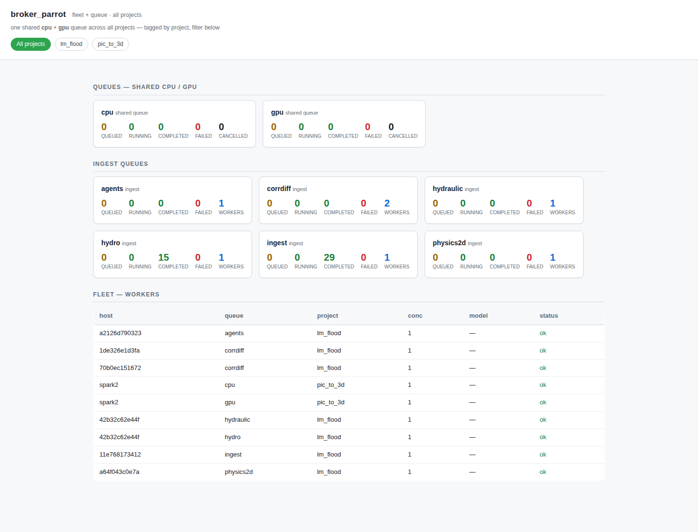

# Conductor — fleet observability + the client/conductor split

The engine ships as **two installable distributions**:

| Distribution | Import package | Role |
|---|---|---|
| `queue_workflows` (the **client**) | `queue_workflows` | the per-project **data plane** — orchestrator, claim workers, dispatcher, queue, model cache, LLM backends, `gpu_pool`, the config seam, and the migration chain. This is what each app installs. |
| `queue-workflows-conductor` (the **conductor**) | `queue_workflows_conductor` | the **control plane** — a read-only fleet view (and, over time, operator tooling) deployed *apart from* the per-app client. |

**The dependency edge points one way: conductor → client.** The conductor *depends on* the client and
consumes its primitives (`node_queue.fleet_snapshot`, `worker_control`); the client — which runs inside
every worker/orchestrator — **never imports the conductor**. A contract test
(`tests/test_client_conductor_boundary.py`) fails if any client module imports the conductor, so the
client stays deployable on its own.

> The split is purely about *packaging + deployment*. The client's import name and distribution name are
> both `queue_workflows`, so adding the conductor changes nothing for existing consumers.

## The `queue-conductor-web` view

`queue-conductor-web --db-backend pg --db-url-env <DSN_ENV>` serves a read-only HTML view of one shared
broker: the reserved `cpu`/`gpu` DAG queues, the host-defined ingest queues, and every reporting worker —
each tagged by `project`, with a per-project filter, so a single broker shows the whole consolidated fleet
at once.



## Observed state — `fleet_snapshot()`

Every claim worker continuously upserts its capacity into `worker_heartbeats`
(`node_queue.upsert_worker_heartbeat`). **`node_queue.fleet_snapshot(*, stale_after_s=30.0, project=None)`**
returns that observed per-`(host, queue)` fleet as a list of rows, each carrying the worker's advertised
capability plus two derived flags. Pass `project="<name>"` to scope the snapshot to a single tenant on a
shared multi-project broker (migration 0017); `project=None` (the default) returns every project's workers:

| field | meaning |
|---|---|
| `host_label`, `queue`, `concurrency` | who, which queue, how many slots |
| `current_model` | the GPU worker's warm model (NULL for cpu/ingest) |
| `known_models`, `llm_servers_available`, `vram_total_mb`, `fits_models` | advertised capability |
| `fresh` | `last_seen` within `stale_after_s` (default 30 s) |
| `flagged_dead` | the orchestrator's dead-worker sweep flagged it (`last_flagged_dead_at` set) |

It deliberately **surfaces stale and dead-flagged workers** rather than filtering them — that's the
point of an observability read. It is the per-worker counterpart to the count-only `snapshot()` /
`ingest_snapshot()`.

## The `queue-conductor` console script

`queue-conductor` renders `fleet_snapshot()` for the database the engine's `db_url_env` points at —
single-DB, read-only, exactly like every other console script (no stored fleet credentials, no
networked service):

```bash
queue-conductor                 # table of every reporting worker
queue-conductor --queue gpu     # filter to one queue
queue-conductor --stale-after 60
queue-conductor --json          # machine-readable, for piping
```

```
QUEUE  HOST                     MODEL              STATUS  VRAM_MB  SERVERS
gpu    box-a                    qwen               ok        24000  ollama,vllm
gpu    box-b                    -                  stale         -  ollama
```

`STATUS` collapses the two flags: `DEAD` (flagged) outranks `stale` (not fresh) outranks `ok`.

## Steering — desired state

Reading is one half; the desired-state twin is the operator **worker ON/OFF control plane**
(`worker_control`, migration 0012), driven by the client's `queue-worker-control` console:

```bash
queue-worker-control --queue gpu --off    # hard-stop + park a (host, queue) worker
queue-worker-control --queue gpu --on
```

See [`worker_control.md`](worker_control.md). The conductor is a **reader** of observed state and a
caller of the existing control writers — it owns no job/DAG/lease/outbox state.

## Deploying the conductor

```bash
pip install queue-workflows-conductor   # pulls in the client (queue_workflows) as a dependency
QUEUE_WORKFLOWS_DB_URL=... queue-conductor --queue gpu
```

The conductor reads an **already-migrated** database (the app's orchestrator owns the migration chain),
so it needs only read access to `worker_heartbeats` plus, for steering, write access to
`worker_controls`.
