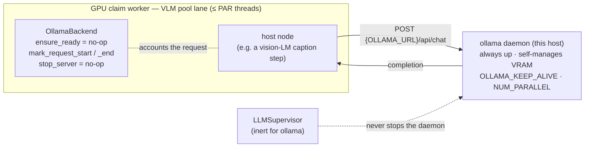
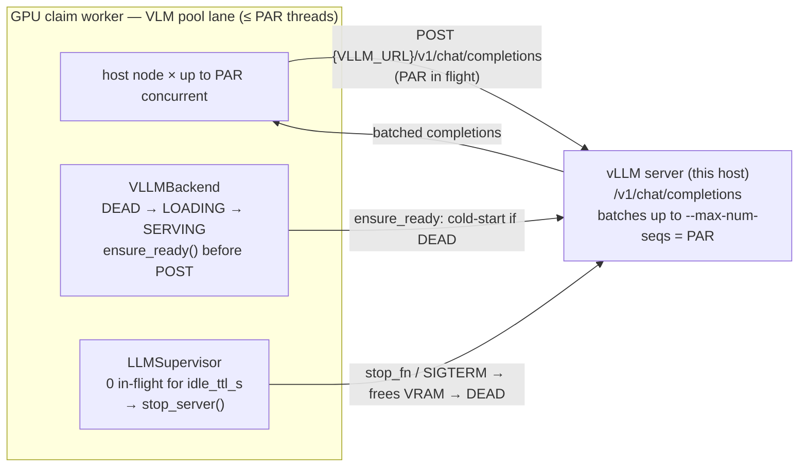
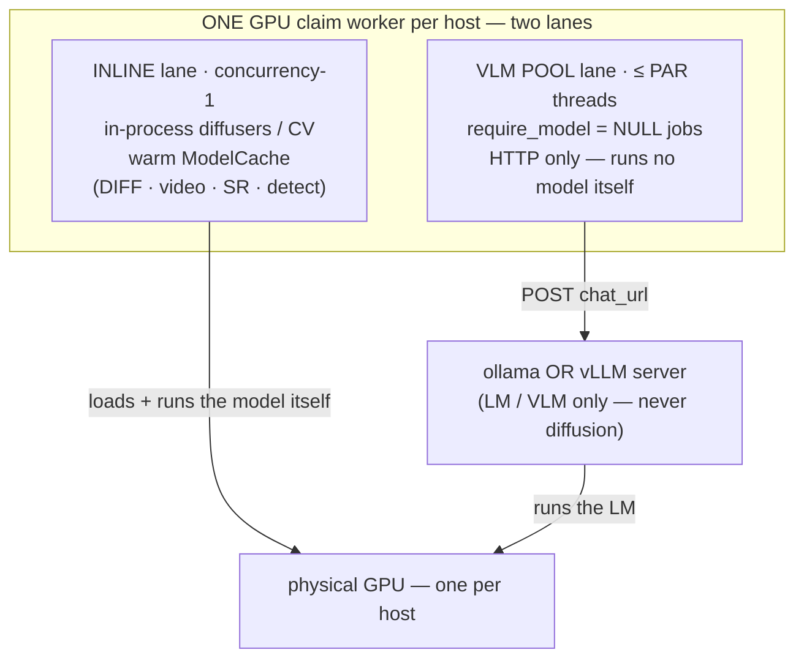

# LLM backends — per-machine ollama / vLLM

A workflow node often needs a co-tenant LLM/VLM server (e.g. a vision model that
captions or reasons over an image) running next to the GPU claim worker. Which
*kind* of server a machine runs — **ollama** (an externally-managed long-lived
daemon) or **vLLM** (an OpenAI-compatible server the engine can stop/start to
reclaim VRAM) — is per-machine, operator-set state. `queue_workflows.llm_backends`
is the polymorphic seam: the worker reads its config, a factory builds the
matching backend, and the node drives it through one surface — never branching on
the server type itself.

This module owns the **request accounting** and the **lifecycle decision**; it
does **not** make the HTTP call (the host node owns the chat POST against
`backend.chat_url`) and it does **not** know about your container runtime (the
host wires that — see `set_vllm_lifecycle`). It imports nothing but stdlib +
`queue_workflows.*`.

## The pieces

- **`LLMBackend`** (ABC) — a host-agnostic handle. Concrete, shared request
  accounting (`mark_request_start` / `mark_request_end` / `inflight` /
  `idle_seconds`, RLock-guarded so the supervisor can read off-thread, mirroring
  `ModelCache`). Abstract identity (`server_type`, `chat_url`, `health_url`) and
  lifecycle (`ensure_ready`, `is_running`, `stop_server`). Deliberately
  OpenAI-chat-shape-biased to ollama + vLLM — a third vendor means a new request
  shape, not just a subclass.
- **`OllamaBackend`** — the baseline. Lifecycle is inert: the daemon is
  externally managed and frees idle VRAM itself via `OLLAMA_KEEP_ALIVE`, so
  `ensure_ready` is a no-op and `stop_server` never fires. `chat_url` →
  `{base}/api/chat`.
- **`VLLMBackend`** (+ `VLLMState`) — a lifecycle state machine
  (`DEAD`/`LOADING`/`SERVING`/`SLEEPING_L2`/`RELOADING`/`UNSUPPORTED_SLEEP`) over
  **fully-injected I/O** (kill / ensure-up / health / served-model probes —
  httpx is lazy-imported inside the defaults). `chat_url` →
  `{base}/v1/chat/completions`, `health_url` → `{base}/health`. A model switch
  tries vLLM Sleep-Mode-L2 reload (stubbed → sticky `UNSUPPORTED_SLEEP`) then
  falls back to stop + bring-up. vLLM holds the model in VRAM for its lifetime
  (no idle-unload of its own), which is why the supervisor exists.
- **`LLMSupervisor`** (+ pure `vllm_should_stop`) — a daemon that frees an idle
  vLLM server's VRAM, mirroring `ModelCache`'s idle reaper: after `idle_ttl_s` of
  zero in-flight requests it calls `backend.stop_server()`. Inert for ollama
  (self-manages) and gated by `AI_LEADS_DISABLE_LLM_SUPERVISOR` for tests.
- **`BackendFactory` / `get_backend(host_label, queue)`** — the per-`(host,
  queue)` owner of the live backend + its supervisor, kept in sync with the DB
  config. A snapshot read-through cache **preserves backend identity** (request
  counters + the vLLM state machine survive) while the config snapshot
  `(server_type, parallelism, vllm_idle_ttl_s)` is unchanged, rebuilds only on an
  actual change, and refreshes on a 10 s TTL or a `worker_llm_config_changed`
  NOTIFY (gated by `AI_LEADS_DISABLE_LLM_CONFIG_LISTENER`). Server-root URLs come
  from `config.ollama_url_env` / `config.vllm_url_env` (deployment topology stays
  in env; the DB owns *which type*).

## Host wiring (the inversion seams)

The library is host-agnostic; the host supplies the runtime-specific bits via
`configure`/`set_*` once at startup:

- **`set_vllm_lifecycle(stop_fn, start_fn)`** — how to stop/start the vLLM server.
  `stop_fn() -> bool` frees VRAM; `start_fn(model_id) -> None` (re)starts it. A
  host that runs vLLM as a **separate container** wires these so the in-worker
  supervisor can control the sibling sidecar **without a docker restart policy**
  (e.g. the docker Engine API over the unix socket). `None` (the default) keeps
  the backend's built-in pkill / no-op seams, so an unconfigured deployment is
  unchanged.
- **`set_llm_servers_available([...])`** — which server types **this host can
  actually run** (e.g. `["ollama"]` on a box without the vLLM image, or
  `["ollama", "vllm"]` on one with it). Published in the worker heartbeat
  (migration 0014) so a UI can gate its per-machine server-type control — don't
  offer vLLM where there's no server for it.

## DB schema

- **Migration 0013** adds to `worker_controls` (operator-desired state):
  `llm_server_type` (`'ollama'|'vllm'`, default `ollama`), `llm_parallelism`
  (the *server's* concurrent-request capacity — ollama `NUM_PARALLEL` / vLLM
  `--max-num-seqs`; NOT the claim-worker concurrency, which stays 1), and
  `vllm_idle_ttl_s`. A trigger NOTIFYs the dedicated `worker_llm_config_changed`
  channel (payload `host|queue`) so a config edit isn't mistaken for an ON/OFF
  change by the hard-stop watcher. Set via `worker_control.set_llm_config`
  (partial COALESCE upsert, never touches `desired_state`) / read via
  `llm_config_for`.
- **Migration 0014** adds `worker_heartbeats.llm_servers_available text[]`
  (default `{ollama}`) — the observed capability the worker advertises, the
  analog of `known_models`.

Both are default-safe: on a DB that predates them the accessors return the
all-defaults config / the `{ollama}` baseline, so the engine and other consumers
run unchanged.

## Operational notes

- One machine runs **one** server type at a time (that's what the toggle means).
- vLLM **cold start** is real (a 7B AWQ on a modern GPU loads in roughly
  1–4 min); the supervisor's idle-stop trades that cold start for reclaimed VRAM.
  ollama is always up but serializes by default (raise `OLLAMA_NUM_PARALLEL`).
- vLLM has **no hot model-swap** — switching models is a server restart; ollama
  hot-loads a new tag on the running daemon.
- A vLLM server must have its model **complete in that host's own model cache**
  before it can serve; an incomplete download makes the loader block (looks like
  a hang). Verify the model is fully present per host.

## How a request flows — ollama vs vLLM

Both options expose the **same surface** to the node (`backend.chat_url` + the
request-accounting bracket); they differ in **who owns the server's lifecycle**
and **whether requests batch**.

### Option A — ollama (externally-managed daemon)

The daemon is always up; the engine never starts or stops it. Lifecycle calls
are inert, so the supervisor does nothing. Idle VRAM is reclaimed by ollama
itself via `OLLAMA_KEEP_ALIVE`. Concurrency is whatever `OLLAMA_NUM_PARALLEL`
allows (serial by default).

### Option B — vLLM (engine-managed, batches, idle-stops)

The engine drives the server's lifecycle through a state machine
(`DEAD → LOADING → SERVING`). `ensure_ready()` cold-starts it on first use
(roughly 1–4 min for a 7B AWQ). The server batches up to `--max-num-seqs = PAR`
concurrent requests — that batching is the whole reason to pick vLLM. When
in-flight requests stay at zero for `vllm_idle_ttl_s`, the `LLMSupervisor` stops
it to free VRAM; the next request pays the cold start again. Switching models is
a restart (no hot swap).

| | ollama | vLLM |
|---|---|---|
| Server lifecycle | external (always up) | engine-managed (start on demand, idle-stop) |
| Idle VRAM | `OLLAMA_KEEP_ALIVE` | supervisor `stop_server()` after `vllm_idle_ttl_s` |
| Concurrency | `OLLAMA_NUM_PARALLEL` (serial by default) | `--max-num-seqs = PAR` continuous batching |
| Model switch | hot-load a new tag | server restart |
| Cold start | none (daemon resident) | real (1–4 min for a 7B) |
| Best when | a model is always needed on a box | bursty VLM load + you want VRAM back for other work |

## When a diffusion model runs on the same host

**A diffusion (or super-resolution / CV) model never goes through ollama or
vLLM.** Those servers only serve language / vision-language models. A
model-backed GPU node runs **in-process** in the claim worker's *inline lane*
(concurrency-1, one warm model held by `ModelCache`). The LLM server, if any,
runs **beside** it on the same physical GPU and is fed only by the *pool lane*.

The two lanes share one GPU, so the engine bounds the total:

- **PAR cap.** While an inline diffusion job runs it occupies one of the PAR
  slots — the pool feeder budgets `PAR − 1` (`_pool_budget` + the
  `_inline_running` flag). Idle inline ⇒ the full PAR pool. A machine's total
  concurrent node-jobs never exceeds PAR.
- **Diffusion is compute-bound** (a single render typically saturates the GPU's
  SMs ≈ 96%), so its lane is concurrency-1 by design — extra diffusion jobs would
  only time-slice the same compute, not add throughput. Concurrency pays for the
  *VLM* lane (LLM/VLM inference is memory-bound and batches), which is exactly the
  split these two lanes encode.
- **VRAM coexistence.** Running a resident LLM server *and* a diffusion model on
  one GPU competes for VRAM. That's why the vLLM supervisor idle-stops the server
  (freeing VRAM for diffusion when no VLM work is in flight) and why
  `vlm_pool_should_defer` packs VLM work onto one box before spilling — so other
  boxes stay free for diffusion or can idle-unload. With ollama, the daemon keeps
  its model resident until `OLLAMA_KEEP_ALIVE` expiry, so size the model to leave
  headroom for the diffusion lane.

In short: **pick the server type per box for the *VLM* lane; the diffusion lane
is unaffected by the choice** — it always runs in-process, capped so the two
lanes never oversubscribe the GPU.
