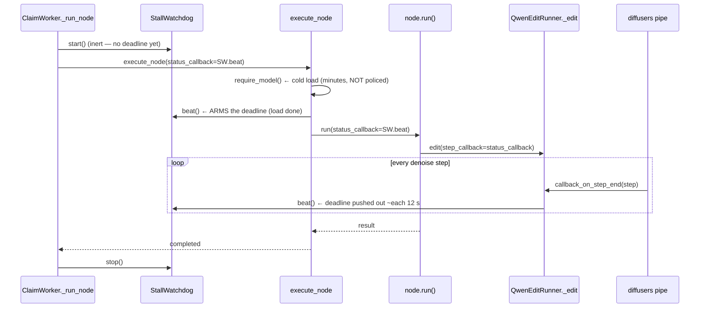
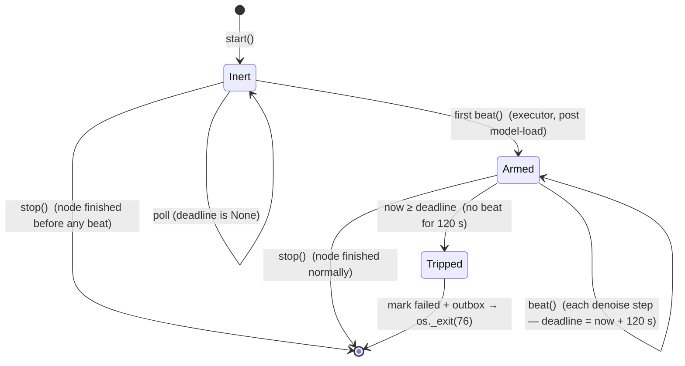
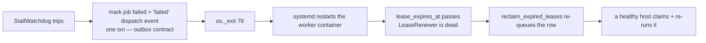

# Watchdogs — keeping a wedged job from camping a worker

A GPU worker is `--concurrency=1`: one process, one model slot, one job at a
time. So a single job that **hangs** doesn't just lose itself — it takes the
whole GPU offline until something frees it. Two daemon threads bracket every
claimed job to guarantee that "something" is automatic. Both live in
`queue_workflows/claim_worker.py`.

| Watchdog | Catches | Signal it watches | Default window |
|---|---|---|---|
| `Watchdog` | a job that runs **too long** | wall-clock elapsed | 8100 s (generic GPU) |
| `StallWatchdog` | a job that makes **no progress** | per-step `beat()` | 120 s (after arming) |

The `StallWatchdog` is the one added to defend against the **Blackwell qwen
inference stall**: the model loads fine, then the denoise loop wedges at **0 %
GPU** and never emits another step. The wall-clock `Watchdog` would let that
camp the full 8100 s (2¼ h); the `StallWatchdog` frees it in ~2 min.

---

## Why a wall-clock budget isn't enough

```
observed hang (box-a2, job 374568c6):

  21:50:58  claim          ┐
  21:51:00  load qwen_edit │  legit cold load (~6 min on a cold cache)
  21:52:03  model loaded   ┘
  21:52:03  …………………………………   GPU 0 %, no denoise step, log frozen
            …………………………………
  04:07:xx  Watchdog trips ← 8100 s budget — 2¼ HOURS of dead GPU
```

`Watchdog` only knows "how long has this run", never "is it still doing work".
A job that takes 290 s normally and a job hung forever look identical to it
until the budget expires.

---

## The two watchdogs side by side

| | **`Watchdog`** (budget) | **`StallWatchdog`** (no-progress) |
|---|---|---|
| Trips on | `elapsed ≥ budget_s` | `now − last_beat ≥ stall_timeout_s` |
| Deadline | fixed at `start()` | resets on every `beat()` |
| Armed | at `start()` | on the **first** `beat()` (inert before) |
| Fed by | nothing (pure clock) | node `status_callback`, one beat per diffusion step |
| Scope | every cpu/gpu/ingest job | **opt-in** non-video gpu nodes (declare `status_callback`) |
| On trip | mark `failed` + outbox event → `os._exit(75)` | mark `failed` + outbox event → `os._exit(76)` |
| Recovery | lease expires → reclaim re-queues | same |

Both funnel their terminal action through one shared helper,
`_fail_job_and_exit(...)`, so the outbox-atomicity contract (terminal mark **and**
the `failed` dispatch event in one txn) is written in exactly one place.

### Wall-clock budgets (`budget_for(job)`)

| Job | Budget |
|---|---|
| GPU, `required_model` ∈ `video_model_ids` | 1800 s |
| GPU, any other model | 8100 s |
| `fetch` ingest sweep | 7200 s |
| `load` ingest sweep | 3600 s |
| host-defined ingest queue | `config.ingest_default_budget_s` |
| `__input__*` park node | 120 s |
| any other CPU node | 2100 s |

---

## How a progress beat flows (the per-step heartbeat)

A beat is one call to `StallWatchdog.beat()`. It originates at the **diffusers
denoise step** and is threaded all the way down as the node's `status_callback`:



Key property: the **executor beats once right after the model load**, which is
what *arms* the watchdog. The minutes-long cold load happens **before** that
beat, so it is never inside the no-progress window — only the inference is.

### What "opt-in" means

`StallWatchdog` is armed **only** for a gpu node whose `run(...)` declares a
`status_callback` parameter (`ClaimWorker._node_reports_progress`) **and** whose
`required_model` is **not** a video model (`config.video_model_ids`). A node that
never reports progress can't be told apart from a hung one, so it's left to the
wall-clock `Watchdog`; a **video** model steps slowly and beats only per
beat-segment (minutes apart), which would false-trip the 120 s window, so it too
is left to the wall-clock budget (1800 s). To protect a new **non-video** gpu node:

1. add `status_callback: Any = None` to its `run(...)`;
2. forward it into the model call as `step_callback=status_callback`;
3. the runner's `_edit` wires `callback_on_step_end` → `step_callback(step)`.

---

## StallWatchdog lifecycle



| State | Deadline | A 120 s silence here means |
|---|---|---|
| Inert | `None` | model still loading — **fine**, not policed |
| Armed | `now + 120 s` | inference is wedged — **trip** |

---

## Recovery after a trip

A trip doesn't just kill the worker — it hands the job back to the fleet:



The hung host's `LeaseRenewer` thread dies with the process, so the lease finally
expires (it was being renewed *independently* of the wedged inference thread —
that decoupling is exactly why the job used to camp forever). `os._exit(76)` vs
`75` lets ops tell a stall apart from a budget overrun in the logs.

---

## Tuning constants (`claim_worker.py`)

| Constant | Value | Meaning |
|---|---|---|
| `STALL_TIMEOUT_S` | 120.0 | max gap between step beats before "hung" |
| `STALL_POLL_S` | 5.0 | how often the watchdog thread checks the deadline |
| `GPU_DEFAULT_BUDGET_S` | 8100 | wall-clock budget, generic GPU job |
| `VIDEO_BUDGET_S` | 1800 | wall-clock budget, `video_model_ids` |
| `LEASE_S` | 600 | lease length (renewed every 10 s while running) |

`STALL_TIMEOUT_S` only has to cover the gap between two diffusion steps
(~12 s observed), with margin for the first step after load — **not** the load
itself, which is excluded by the inert-until-first-beat design.
