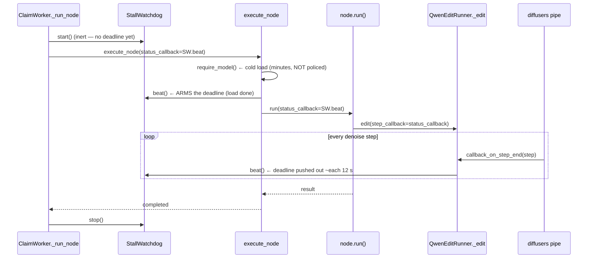
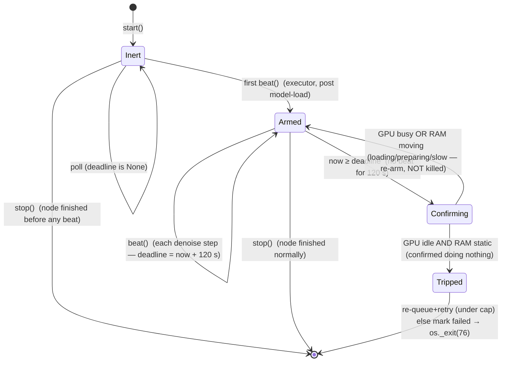
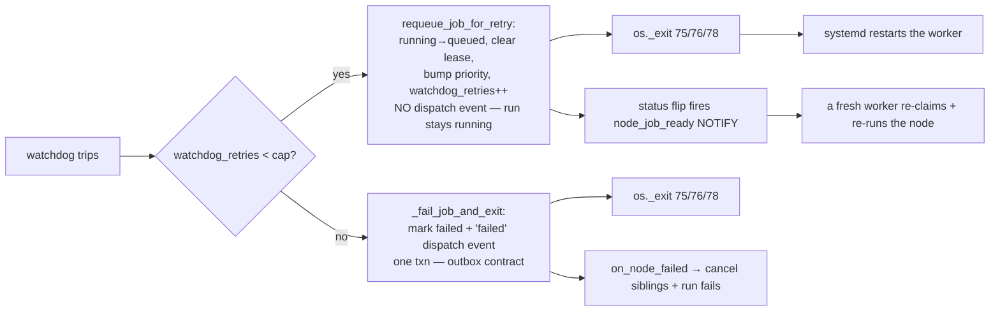
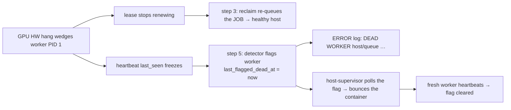

# Watchdogs — keeping a wedged job from camping a worker

A GPU worker is `--concurrency=1`: one process, one model slot, one job at a
time. So a single job that **hangs** doesn't just lose itself — it takes the
whole GPU offline until something frees it. Daemon threads bracket every claimed
job to guarantee that "something" is automatic (`Watchdog`, `StallWatchdog`, and
the health-driven `GpuHealthWatchdog`). They all live in
`queue_workflows/claim_worker.py`.

A trip does **not** fail the workflow on the first wedge: it **re-queues the node
for a retry** on a fresh worker (the run stays `running`) up to a per-job cap,
then fails the run only if the node keeps wedging — see
[Re-queue then fail](#re-queue-then-fail-after-a-cap).

| Watchdog | Catches | Signal it watches | Default window |
|---|---|---|---|
| `Watchdog` | a job that runs **too long** | wall-clock elapsed | 8100 s (generic GPU) |
| `StallWatchdog` | a job making **no progress** *and confirmed idle* | per-step `beat()`, **gated** by GPU util + RAM | 120 s (after arming) |
| `GpuHealthWatchdog` | a GPU job **truly wedged** | per-container GPU util + RAM | 300 s window |

The `StallWatchdog` is the one added to defend against the **Blackwell qwen
inference stall**: the model loads fine, then the denoise loop wedges at **0 %
GPU** and never emits another step. The wall-clock `Watchdog` would let that
camp the full 8100 s (2¼ h); the `StallWatchdog` frees it in ~2 min.

But **no beat ≠ wedged.** A node can be mid-load, preparing, or in a legitimately
slow step and emit no beat for a while — killing it then is a false positive (the
user's report: *"should not kill if the GPU model is being loaded or preparing to
start; only if it does nothing"*). So the `StallWatchdog` does **not** trip on
beat-absence alone: when its timeout fires it **confirms against the physical
signal** (GPU util + container RAM) and trips **only** if the worker is genuinely
doing nothing — see [Gating the no-progress trip](#gating-the-no-progress-trip-on-the-physical-signal).

---

## Why a wall-clock budget isn't enough

```
observed hang (host-b, job 374568c6):

  21:50:58  claim          ┐
  21:51:00  load qwen_edit │  legit cold load (~6 min on a cold cache)
  21:52:03  model loaded   ┘
  21:52:03  …………………………………   GPU 0 %, no denoise step, log frozen
            …………………………………
  04:07:xx  Watchdog trips ← 8100 s budget — 2¼ HOURS of dead GPU
```

`Watchdog` only knows "how long has this run", never "is it still doing work".
A job that takes 290 s normally and a job hung forever look identical to it
until the budget expires.

---

## The two watchdogs side by side

| | **`Watchdog`** (budget) | **`StallWatchdog`** (no-progress) |
|---|---|---|
| Trips on | `elapsed ≥ budget_s` | `now − last_beat ≥ stall_timeout_s` **AND** GPU idle **AND** RAM static |
| Deadline | fixed at `start()` | resets on every `beat()` (and on a suspected-but-unconfirmed stall) |
| Armed | at `start()` | on the **first** `beat()` (inert before) |
| Fed by | nothing (pure clock) | node `status_callback`, one beat per diffusion step |
| Confirmation | none | on timeout, samples `gpu_health` GPU util + RAM ([§](#gating-the-no-progress-trip-on-the-physical-signal)) |
| Scope | every cpu/gpu/ingest job | **opt-in** non-video gpu nodes (declare `status_callback`) |
| On trip | **re-queue + retry** (under cap), else `failed` → `os._exit(75)` | same, → `os._exit(76)` |
| Recovery | immediate re-queue (run stays alive) | same |

All three watchdogs also **clear the worker's `current_model` busy-ghost** before
the hard-exit so a killed worker doesn't keep inflating the GPU-busy gauge — see
[Don't leave a busy ghost](#dont-leave-a-busy-ghost).

Both funnel their action through one shared decision point, `_watchdog_trip(...)`,
which **re-queues the node for a retry** while it's under the per-job cap (see
[Re-queue then fail](#re-queue-then-fail-after-a-cap)) and otherwise falls back to
`_fail_job_and_exit(...)` — the shared mark-failed helper that writes the
outbox-atomicity contract (terminal mark **and** the `failed` dispatch event in
one txn) in exactly one place.

### Wall-clock budgets (`budget_for(job)`)

| Job | Budget |
|---|---|
| GPU, `required_model` ∈ `video_model_ids` | 1800 s |
| GPU, any other model | 8100 s |
| `fetch` ingest sweep | 7200 s |
| `load` ingest sweep | 3600 s |
| host-defined ingest queue | `config.ingest_default_budget_s` |
| `__input__*` park node | 120 s |
| any other CPU node | 2100 s |

---

## How a progress beat flows (the per-step heartbeat)

A beat is one call to `StallWatchdog.beat()`. It originates at the **diffusers
denoise step** and is threaded all the way down as the node's `status_callback`:



Key property: the **executor beats once right after the model load**, which is
what *arms* the watchdog. The minutes-long cold load happens **before** that
beat, so it is never inside the no-progress window — only the inference is.

### What "opt-in" means

`StallWatchdog` is armed **only** for a gpu node whose `run(...)` declares a
`status_callback` parameter (`ClaimWorker._node_reports_progress`) **and** whose
`required_model` is **not** a video model (`config.video_model_ids`). A node that
never reports progress can't be told apart from a hung one, so it's left to the
wall-clock `Watchdog`; a **video** model steps slowly and beats only per
beat-segment (minutes apart), which would false-trip the 120 s window, so it too
is left to the wall-clock budget (1800 s). To protect a new **non-video** gpu node:

1. add `status_callback: Any = None` to its `run(...)`;
2. forward it into the model call as `step_callback=status_callback`;
3. the runner's `_edit` wires `callback_on_step_end` → `step_callback(step)`.

---

## StallWatchdog lifecycle



| State | Deadline | A 120 s silence here means |
|---|---|---|
| Inert | `None` | model still loading — **fine**, not policed |
| Armed | `now + 120 s` | *suspected* stall — go **Confirming**, don't kill yet |
| Confirming | — | sample GPU util + RAM: busy/moving ⇒ re-arm; idle+static ⇒ **trip** |

---

## Gating the no-progress trip on the physical signal

**The problem with beat-absence alone.** A missing beat is a *suspicion*, not a
verdict. The same 120 s silence is produced by four very different states:

| State | GPU util | Container RAM | Kill? |
|---|---|---|---|
| Wedged (qwen 0 %-GPU hang) | idle (`≤ idle_pct`) | static | **yes** |
| Loading weights / preparing | idle (not yet issuing SM work) | **climbing** (GBs) | no |
| Legitimately slow step | **busy** | (any) | no |
| Slow decode / staging | idle | **moving** | no |

The old `StallWatchdog` tripped on the silence alone, so it could kill a node
that was still loading, preparing, or grinding a slow step — exactly the user's
false positive.

**The fix: confirm before tripping.** When the no-beat timeout fires, the
`StallWatchdog` does **not** trip. It runs a short confirmation window
(`confirm_samples` reads, `confirm_poll_s` apart) using the **same** `gpu_health`
samplers and the **same** `GPU idle AND RAM static` predicate the
`GpuHealthWatchdog` uses — so the two watchdogs share one definition of "idle":

```
on no-beat timeout:
    sample MAX(gpu_util) and Δ(container_ram) over the confirm window
    if max_gpu_util ≤ idle_pct AND |Δram| ≤ ram_delta_mb:
        → genuinely doing nothing → TRIP
    else:
        → busy / loading / preparing / slow → re-arm the window, LOG, do NOT kill
```

Because a multi-GB model load **moves RAM far beyond the 5 GB delta**, a cold or
lazy model load can *never* be confirmed as wedged — it always falls into the
"RAM moving ⇒ not killed" branch. A busy GPU (a slow but real step) always falls
into the "GPU busy ⇒ not killed" branch. Only `GPU idle AND RAM static` — the
literal "does nothing" signature — trips. The unconfirmed path **re-arms** the
deadline (it doesn't latch), so a transient slow patch followed by resumed
progress is fully recoverable.

The confirmation adds `confirm_samples × confirm_poll_s` (~2 s by default) to a
real trip — negligible against the 120 s window. Samplers are injected
(`gpu_sampler` / `ram_sampler`, default `gpu_health`), so tests feed fakes and
need no GPU.

| Constant / env | Default | Meaning |
|---|---|---|
| `STALL_CONFIRM_SAMPLES` / `AI_LEADS_STALL_CONFIRM_SAMPLES` | 3 | GPU/RAM reads taken to confirm a suspected stall |
| `STALL_CONFIRM_POLL_S` / `AI_LEADS_STALL_CONFIRM_POLL_S` | 1.0 | spacing between confirmation reads |
| `GPU_IDLE_PCT` / `AI_LEADS_GPU_IDLE_PCT` | 5 | GPU util at/under which GPU counts as idle (shared with `GpuHealthWatchdog`) |
| `GPU_HEALTH_RAM_DELTA_MB` / `AI_LEADS_GPU_HEALTH_RAM_DELTA_MB` | 5120 | RAM move above which the job counts as working (shared) |

---

## Don't leave a busy ghost

`os._exit` (how every watchdog hard-stops a wedged worker) is brutal by design —
it's the only way to abandon a node body stuck deep in a CUDA kernel. But it
**skips `_run_node`'s `finally`**, so `ModelCache.mark_idle` and the worker's
heartbeat refresh never run. The worker's last-written `worker_heartbeats` row
therefore keeps advertising a `current_model` even though the process is dead —
and Rails' queue gauge counts any fresh row with a non-null `current_model` as a
busy GPU. The user saw the symptom directly: **"3/2 GPU busy"** after a kill (a
phantom third busy worker that no longer exists).

So, right before the hard-exit, both trip outcomes (`_requeue_job_and_exit` and
`_fail_job_and_exit`) call `_clear_busy_ghost(host_label, queue)` →
`node_queue.clear_worker_current_model`, which in one statement:

* **nulls `current_model`** for this `(host_label, queue)` row — the worker stops
  advertising a warm model; and
* **ages `last_seen`** ~100 s into the past (10× the 10 s heartbeat cadence) so
  the gauge — which only counts rows fresh within 30 s — **drops the dead worker
  at once**, rather than waiting up to 30 s for the heartbeat to age out.

It's **best-effort**: scoped by the `(host_label, queue)` primary key, a no-op
when the row is absent or the worker identity wasn't threaded through, and every
error is swallowed — **the hard-exit must happen regardless** (a hung DB write
must never block the kill). A replacement worker's fresh heartbeat re-establishes
the row normally. The watchdogs receive `host_label` / `queue` from the
`ClaimWorker` (`self.host` / `self.queue`) at construction.

---

## Re-queue then fail after a cap

A trip is, by default, a **transient-wedge signal**: the same node usually runs
fine on a fresh worker (the canonical case is the Blackwell qwen stall, which
clears on a restart). So a trip **re-queues the node for a retry** instead of
failing the whole workflow:



Mechanics of the re-queue (`node_queue.requeue_job_for_retry`, one txn): flip the
row `running → queued`, clear the lease (`claimed_by`/`lease_expires_at` → NULL),
bump `priority` to the front with `LEAST(priority, 10)` (the **exact** mechanic
`reclaim_expired_leases` uses, so the retry runs promptly), and increment the
per-job `watchdog_retries` counter (migration 0010). It writes **no** dispatch
event — the run stays `running`, only the node re-runs. The `queued` flip fires
the `node_job_ready` NOTIFY (migration 0006) so an idle worker re-claims it at
once; no waiting for the lease to expire.

**The cap stops an infinite loop.** A node that wedges *every* time would otherwise
re-queue forever. Once its `watchdog_retries` reaches `AI_LEADS_WATCHDOG_MAX_RETRIES`
(default **3**) the trip falls back to `_fail_job_and_exit` — the old behaviour
(mark failed + `failed` dispatch event → `on_node_failed` cancels siblings and
flips the run to `failed`). So: **N transient retries, then a clean run-failure.**

**Why it can't double-run.** The re-queue sets `status='queued'` and clears
`claimed_by`, then the worker hard-exits (`os._exit`). The fresh re-claim is the
same CAS-guarded `queued → running` UPDATE as any claim, so only one worker wins
it. And any *other* worker that still thought it held the row self-exits the
instant its `JobStatusWatcher` sees `claimed_by` no longer equals it. Node bodies
are idempotent on their `out_dir`, so even a re-run that overlaps a dying process
converges. `os._exit(76)`/`75`/`78` still lets ops tell a stall / budget / health
trip apart in the logs.

**Belt-and-braces with the lease reclaim.** If the re-queue write itself fails
(DB blip), the worker *still* hard-exits, leaving the row `running` with a lease
its now-dead `LeaseRenewer` can no longer renew — so `reclaim_expired_leases`
re-queues it when the lease lapses. The node is never silently stranded.

**Ingest jobs are the exception.** An `ingest_jobs` trip keeps the old mark-failed
path: there's no DAG run to keep alive, no `watchdog_retries` column, and the
ingest path has its own `reclaim_expired_ingest_leases` re-queue.

---

## Tuning constants (`claim_worker.py`)

| Constant | Value | Meaning |
|---|---|---|
| `STALL_TIMEOUT_S` | 120.0 | max gap between step beats before a stall is *suspected* |
| `STALL_POLL_S` | 5.0 | how often the watchdog thread checks the deadline |
| `STALL_CONFIRM_SAMPLES` / `AI_LEADS_STALL_CONFIRM_SAMPLES` | 3 | GPU/RAM reads taken to **confirm** a suspected stall before tripping |
| `STALL_CONFIRM_POLL_S` / `AI_LEADS_STALL_CONFIRM_POLL_S` | 1.0 | spacing between confirmation reads |
| `GPU_DEFAULT_BUDGET_S` | 8100 | wall-clock budget, generic GPU job |
| `VIDEO_BUDGET_S` | 1800 | wall-clock budget, `video_model_ids` |
| `LEASE_S` | 600 | lease length (renewed every 10 s while running) |
| `WATCHDOG_MAX_RETRIES` / `AI_LEADS_WATCHDOG_MAX_RETRIES` | 3 | watchdog re-queue retries on a DAG node before the run fails (read at trip-time) |

`STALL_TIMEOUT_S` only has to cover the gap between two diffusion steps
(~12 s observed), with margin for the first step after load — **not** the load
itself, which is excluded by the inert-until-first-beat design. And even when it
elapses, the trip is **gated** on a GPU-idle + RAM-static confirmation
([§](#gating-the-no-progress-trip-on-the-physical-signal)) so a slow-but-working
or still-loading node is never killed.

---

## The last-resort layer: orchestrator-side dead-worker detection

Every watchdog above runs **inside the worker process** (`claim_worker.py`),
as a daemon **thread**. That shares a fatal assumption: the worker's Python
interpreter is still schedulable enough to run those threads and execute their
trip. A **GPU hardware-hang** can break that assumption.

### The incident (host-c / ROCm, observed 11:35)

A `wan_i2v` render hit a ROCr **"GPU Hang"** HW exception:

```
  11:35   wan_i2v render running (in-process torch/HIP call) ┐
  11:35   ROCr "GPU Hang" HW exception                       │  the GPU context dies
  11:35   inference call blocks inside the dead HIP context   │  PID 1 stuck in this call
  11:35   worker_heartbeats.last_seen FREEZES …………………………………  ┘  stops claiming overflow work
   ⋯      (29 min of a wedged worker)
  11:35+  DB lease-reclaim re-queues the JOB onto host-a  ← good, the work is safe
   ⋯      …but the wedged PROCESS sat there until a manual `docker restart`.
```

The `GpuHealthWatchdog` (the universal GPU guard) did **not** recover it.

### Why the in-process watchdog didn't fire — root cause

Three candidate causes, in order of how load-bearing they are:

1. **The trip signal was never satisfied (primary).** The `GpuHealthWatchdog`
   trips only on **GPU-idle AND static-RAM** over its window. On a **ROCm** box
   `gpu_util_pct()` has no per-process `pmon` path, so it falls back to the
   **box-level** probe (`hw_metrics._gpu_probe`). A box-level read can stay
   `> idle_pct` (driver/contention noise, or any other GPU consumer) even though
   *this* render is wedged — and a hung render holds its weights resident, so the
   container RAM is **static**. "GPU not provably idle" ⇒ the `gpu_idle AND
   not ram_moved` predicate is never both-true ⇒ **no trip**, indefinitely. The
   guard is a detector of "no GPU work AND no memory movement"; a HW-hang that
   leaves the box GPU reading non-idle is outside what it can see.
2. **Arming was *not* the cause here.** The deployed build armed only on the
   post-load `beat()`, leaving a hang *during* load unpoliced; the working-tree
   change arms **at start** with a load-grace (see `GpuHealthWatchdog.start`).
   But this render had already loaded and begun stepping, so it *was* armed —
   arming is not why it survived.
3. **GIL was *not* the cause here.** A HIP call wedged holding the GIL would
   freeze the daemon threads outright. But the process was observed in
   interruptible sleep (`Isl`), i.e. the GIL was released while blocked in the
   driver — so the watchdog **thread was running**; it polled, sampled, and
   simply never met its trip predicate (cause #1). (On a different hang that
   *does* hold the GIL, #1 and #3 compound — and the in-process design can't win
   either way. That is the general argument for moving recovery out of process.)

The through-line: **any** recovery that lives in the wedged process's own
threads is fragile against a hard GPU hang — whether because the trip signal is
unobservable from inside (#1) or because the threads can't run (#3).

### The fix — a separate, GIL-independent process does the detection

The **orchestrator** (`node_pool.NodePool`) is a *different process*. Its 0.5 s
`_tick` already runs the lease-reclaim sweeps; we add a fifth step,
`_sweep_dead_workers`, calling
`node_queue.flag_stale_workers_holding_running_jobs`:

```sql
-- a worker is DEAD-while-holding-work iff its heartbeat froze
-- AND it still owns a running job (joined claimed_by = host_label):
  worker_heartbeats wh
    JOIN workflow_node_jobs j
      ON j.claimed_by = wh.host_label AND j.status = 'running'
 WHERE wh.last_seen < now() - 30 s         -- 3× the 10 s heartbeat cadence
   AND (last_flagged_dead_at IS NULL OR < now() - 30 s)   -- idempotent
```

It stamps `worker_heartbeats.last_flagged_dead_at = now()` (migration 0009) and
logs an actionable `DEAD WORKER:` ERROR line. The **claim** stamps `claimed_by`
with the worker's host label — the same value `worker_heartbeats` is keyed on —
so the join needs no new bookkeeping.

Recovery is split, and both halves now exist:

| Concern | Recovered by | When |
|---|---|---|
| the **JOB** (re-run on a healthy host) | lease-reclaim sweep (step 3) | lease lapses (≤ `LEASE_S`) |
| the **dead PROCESS** (flagged for bounce) | dead-worker sweep (step 5) | heartbeat stale + owns running job |

Idempotency: the flag is set once, then suppressed (the `last_flagged_dead_at`
guard) so the 0.5 s tick doesn't relog. A fresh heartbeat — the worker resumes,
or a host-supervisor restarts it — **clears** the flag in
`upsert_worker_heartbeat`, so a future hang re-flags cleanly.



### Residual / design: the host-supervisor hook (not implemented in-engine)

The orchestrator **flags** but does **not kill** the wedged worker. A
cross-host container restart isn't safe or feasible from the orchestrator: it
has no docker socket, and the worker is on a *different host* (host-a / host-b)
reachable only over SSH/FRP. Killing belongs to whatever supervises the worker
**on its own host** (systemd / docker restart-policy / a small host daemon).
The engine's contract is to expose a clean, durable, queryable signal; the host
acts on it. Two equivalent host-side consumers:

* **Poll the flag (simplest).** A host cron / tiny daemon, scoped to *its own*
  `host_label`, restarts the local gpu worker container when its row is freshly
  flagged:

  ```sql
  SELECT 1 FROM worker_heartbeats
   WHERE host_label = :this_host AND queue = 'gpu'
     AND last_flagged_dead_at > now() - interval '90 seconds';
  -- non-empty ⇒  docker restart app-worker-workers-gpu-1
  ```

  Safe because the JOB is already re-queued (the displaced worker's
  `JobStatusWatcher` would hard-exit it on claim-loss anyway), so the restart
  only frees the wedged process — it can never double-run the work.

* **In-worker GIL-proof sibling (the heavier alternative).** Fork a *tiny
  subprocess* (not a thread) at worker start that watches a heartbeat file/pipe
  the main loop touches each tick and `SIGKILL`s the worker if it goes stale.
  GIL-proof (separate process) and host-local (no cross-host problem), but it
  duplicates liveness state the DB heartbeat already carries and adds a fork to
  every worker. The orchestrator-side detector was chosen as the higher-value,
  lower-risk slice; this remains the option if a host wants **self**-bounce
  without a supervisor consuming the DB flag.

### Tuning constants (dead-worker detection)

| Constant / env | Default | Meaning |
|---|---|---|
| `node_queue.STALE_WORKER_AFTER_S` / `AI_LEADS_STALE_WORKER_AFTER_S` | 30 s | heartbeat age over which a worker is "stale" (3× the 10 s cadence) |
| `AI_LEADS_DEAD_WORKER_SWEEP_INTERVAL_S` | 5 s | how often the orchestrator runs the detector (interval-gated like reclaim) |
